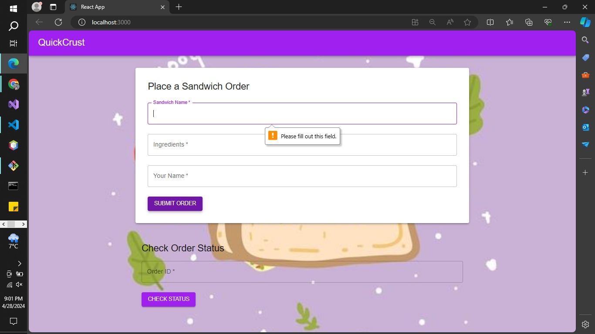
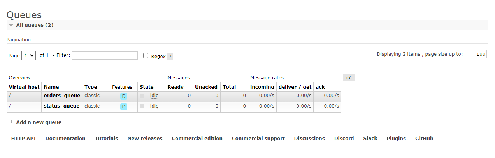
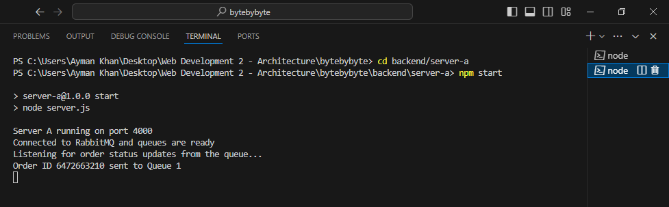
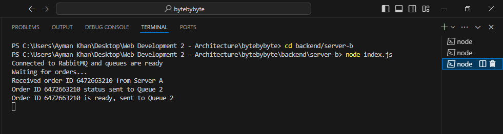
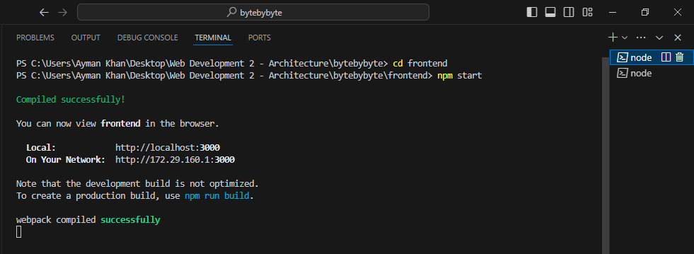
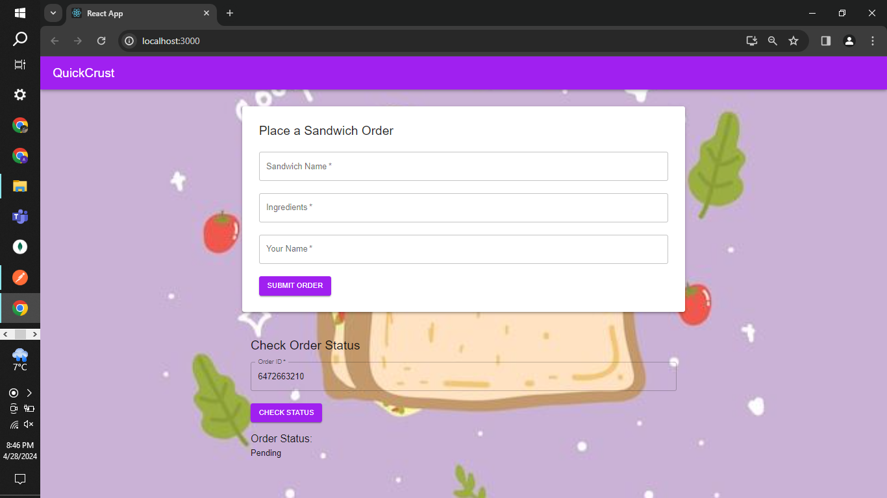
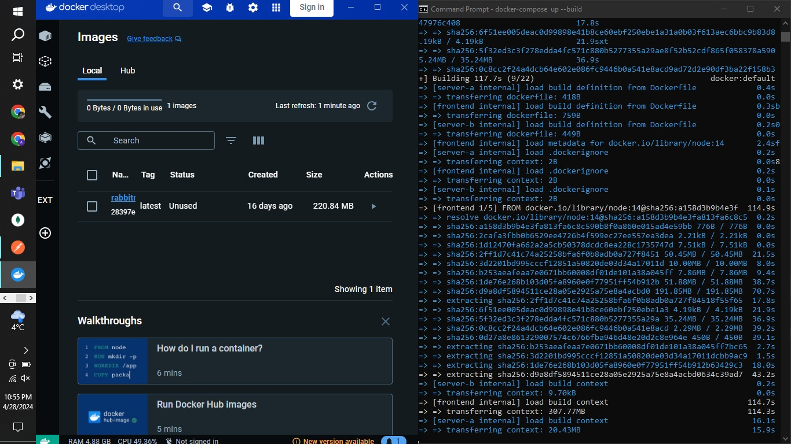

# Sandwich Order App

The Sandwich Order App is a web application that allows users to place sandwich orders and query the status of their orders. It consists of a frontend application which communicates with backend using Swagger API and two backend servers (Server A and Server B) that communicate using RabbitMQ.



## Table of Contents

- [Overview](#overview)
- [Components](#components)
- [Dependencies](#dependencies)
- [Installation and Setup](#installation-and-setup)
- [Running the App](#running-the-app)
- [Directory Structure](#directory-structure)

## Overview

- **Frontend**: A web application built with React and Material UI. It allows users to place sandwich orders and check the status of their orders. (A more detailed implementation overview is provided here: bytebybyte\frontend\README.md)
- **Server A**: Receives orders from the frontend and sends them to Server B using RabbitMQ. It also handles querying order status from Server B. (A more detailed implementation overview is provided here: bytebybyte\backend\server-a\README.md)
- **Server B**: Receives orders from Server A, simulates sandwich preparation, and sends order ready messages back to Server A using RabbitMQ. (A more detailed implementation overview is provided here: bytebybyte\backend\server-b\README.md)

## Components

### Frontend

- **React**: A JavaScript library for building the frontend web application.
- **Material UI**: A library for creating a clean and aesthetic UI for the frontend.

### Backend

- **Node.js**: Runtime environment for Server A and Server B.
- **Express**: Web framework for building REST APIs.
- **RabbitMQ**: Message broker used for communication between Server A and Server B.

## Dependencies

- **Frontend**: React, Material UI, and other related packages.
- **Server A and Server B**: Node.js, Express, amqplib (for RabbitMQ integration), and other related packages.

## Installation and Setup

1. **Clone the repository**:

    ```shell
    git clone https://github.com/your-repo/bytebybyte.git
    cd bytebybyte
    ```

2. **Install dependencies for each part**:

    - **Frontend**: Change to the frontend directory and install dependencies:

        ```shell
        cd frontend
        npm install
        ```

    - **Server A**: Change to the server-a directory and install dependencies:

        ```shell
        cd server-a
        npm install
        ```

    - **Server B**: Change to the server-b directory and install dependencies:

        ```shell
        cd server-b
        npm install
        ```

3. **Ensure RabbitMQ is running locally**:

    RabbitMQ needs to be running locally for Server A and Server B to communicate. You can use Docker to start RabbitMQ:

    ```shell
    docker run -d --name rabbitmq -p 5672:5672 -p 15672:15672 rabbitmq:management
    ```

    This command starts a RabbitMQ container and maps ports 5672 and 15672 to your local machine.

     

## Running the App

1. **Start Server A**:

    Change to the `server-a` directory and start the server:

    ```shell
    cd server-a
    npm start
    ```

    Server A will start on port 4000 by default.

    

2. **Start Server B**:

    Change to the `server-b` directory and start the server:

    ```shell
    cd server-b
    node index.js
    ```
    

3. **Start the Frontend**:

    Change to the `frontend` directory and start the application:

    ```shell
    cd frontend
    npm start
    ```

    The frontend will start on port 3000 by default.

    

4. **Access the App**:

    Once all components are running, you can access the Sandwich Order App in your browser at:

    [http://localhost:3000](http://localhost:3000)

5. **Place Orders and Check Status**:

    Use the frontend to place sandwich orders and check the status of existing orders. Server A will handle receiving orders and querying order statuses. Server B will simulate sandwich preparation and send order ready messages back to Server A.

    


# Project Dockerization

This project is set up to run using Docker and Docker Compose. Follow the instructions below to build and run the project.

## Prerequisites

- **Docker**: Install Docker from [here](https://www.docker.com/get-started).
- **Docker Compose**: Docker Compose is included with Docker Desktop. You can verify the installation by running the command:

  ```sh
  docker-compose --version

## Running the Project

1. **Navigate to the Project Directory**: Open a terminal and navigate to the directory that contains the `docker-compose.yml` file. This is usually the root directory of the project.

    ```sh
    cd bytebybyte
    ```

2. **Build and Start the Project**: Once you are in the project directory, run the following command to build and start the project:

    ```sh
    docker-compose up --build
    ```

    This command builds the Docker images for the services and starts all the services defined in the `docker-compose.yml` file.

3. **Stopping the Project**: To stop the running project, press `Ctrl + C` in the terminal where the services are running. Alternatively, you can stop and remove all the services using the following command:

    ```sh
    docker-compose down
    ```

 


